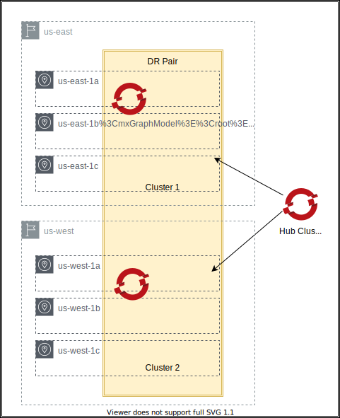

# OpenShift Regional Disaster Recovery
<!-- TOC -->

- [OpenShift Regional Disaster Recovery](#openshift-regional-disaster-recovery)
  - [Overview](#overview)
  - [Prerequisites](#prerequisites)
  - [Install the OpenShift GitOps operator in the Hub cluster](#install-the-openshift-gitops-operator-in-the-hub-cluster)
    - [Using the OCP console](#using-the-ocp-console)
    - [Using a terminal](#using-a-terminal)
  - [Install RHACM](#install-rhacm)
  - [Add this repo to Hub Cluster](#add-this-repo-to-hub-cluster)
  - [Folders](#folders)
  - [Create credential on RHACM server](#create-credential-on-rhacm-server)
  - [Issues](#issues)
    - [Ramen configuration not updated in the openshift-dr-system namespace](#ramen-configuration-not-updated-in-the-openshift-dr-system-namespace)
    - [Hub cluster console not restarting when managed clusters are hibernating](#hub-cluster-console-not-restarting-when-managed-clusters-are-hibernating)
  - [References](#references)

<!-- /TOC -->

## Overview

These instructions show how to use OpenShift GitOps to deploy two OpenShift clusters paired in disaster-recovery mode.

The disaster-recovery is rooted in two components:

- [Red Hat Advanced Cluster Management](https://access.redhat.com/documentation/en-us/red_hat_advanced_cluster_management_for_kubernetes/2.6)
- [ODF Disaster Recovery](https://access.redhat.com/documentation/en-us/red_hat_openshift_data_foundation/4.11/html/configuring_openshift_data_foundation_disaster_recovery_for_openshift_workloads/introduction-to-odf-dr-solutions_common)

The idea is to create two OpenShift clusters in two different cloud regions and pair them via RHACM.



## Prerequisites

- OpenShift Cluster 4.11.x or higher to host the RHACM hub cluster

## Install the OpenShift GitOps operator in the Hub cluster

### Using the OCP console

1. From the Administrator's perspective, navigate to the OperatorHub page.

1. Search for "Red Hat OpenShift GitOps." Click on the tile and then click on "Install."

1. Keep the defaults in the wizard and click on "Install."

1. Wait for it to appear in the " Installed Operators list." If it doesn't install correctly, you can check its status on the "Installed Operators" page in the `openshift-operators` namespace.

### Using a terminal

1. Open a terminal and ensure you have the OpenShift CLI installed:

   ```sh
   oc version --client

   # Client Version: 4.10.42
   ```

   Ideally, the client's minor version should be at most one iteration behind the server version. Most commands here are pretty basic and will work with more significant differences, but keep that in mind if you see errors about unrecognized commands and parameters.

   If you do not have the CLI installed, follow [these instructions](https://docs.openshift.com/container-platform/4.7/cli_reference/openshift_cli/getting-started-cli.html).

1. [Login to the OpenShift CLI](https://docs.openshift.com/container-platform/4.7/cli_reference/openshift_cli/getting-started-cli.html#cli-logging-in_cli-developer-commands)

1. Create the `Subscription` resource for the operator:

   ```sh
   cat << EOF | oc apply -f -
   ---
   apiVersion: operators.coreos.com/v1alpha1
   kind: Subscription
   metadata:
      name: openshift-gitops-operator
      namespace: openshift-operators
   spec:
      channel: stable
      installPlanApproval: Automatic
      name: openshift-gitops-operator
      source: redhat-operators
      sourceNamespace: openshift-marketplace
   EOF
   ```

## Install RHACM

Follow [these instructions](https://github.com/IBM/cloudpak-gitops/blob/main/docs/rhacm.md#installation) for a GitOps-based approach to the installation or follow the [RHACM product documentation](https://access.redhat.com/documentation/en-us/red_hat_advanced_cluster_management_for_kubernetes/) for the official installation procedure.

## Add this repo to Hub Cluster

```sh
ocp_dr_gitops_url=https://github.com/nastacio/ocp-dr
ocp_dr_gitops_branch=main
image_set_ref=img4.11.20-x86-64-appsub
argocd app create ocp-dr-app \
      --project default \
      --dest-server https://kubernetes.default.svc \
      --repo ${ocp_dr_gitops_url:?} \
      --path config/app/ \
      --helm-set repoURL=${ocp_dr_gitops_url:?} \
      --helm-set targetRevision=${ocp_dr_gitops_branch:?} \
      --helm-set metadata.cluster.image_set_ref=${image_set_ref:-img4.11.20-x86-64-appsub} \
      --sync-policy automated \
      --revision ${ocp_dr_gitops_branch:?}  \
      --upsert \
&& argocd app wait -l app.kubernetes.io/instance=ocp-dr-app \
      --sync \
      --health \
      --operation
```

## Folders

These are the ArgoCD application folders in this repository.

|               |             |
| ------------- | ----------- |
| Folder        | Description |
| config/app    | Top-level App-of-Apps for all the other GitOps `Application` resources. |
| config/rhacm  | All additions required to enable a RHACM cluster for orchestrating disaster recovery between peered clusters. |
| config/odf    | OpenShift Data Foundation cluster(only tested with AWS). |
| config/clusters | Pair of managed clusters (created via RHACM API) with non-overlapping networks. |

## Create credential on RHACM server

This step is simple in concept - create a generic secret in the cluster - but the contents of the secret vary with each target Cloud.

The ["Managing Credentials"](https://access.redhat.com/documentation/en-us/red_hat_advanced_cluster_management_for_kubernetes/2.6/html-single/multicluster_engine/index#credentials) section of the RHACM documentation contains the detailed process for adding credentials to the cluster, including links to the respective content sources.

This repository was only tested in AWS, but you should be able to modify it to use other providers, indicating the name of the secret and respective namespace under the `.metadata.rhacm.secret` and `.metadata.rhacm.secret_namespace` parameters of the `ocp-dr-app` Argo application.

## Issues

### Ramen configuration not updated in the openshift-dr-system namespace

The [ODF 4.11 instructions](https://access.redhat.com/documentation/en-us/red_hat_openshift_data_foundation/4.11/html-single/configuring_openshift_data_foundation_disaster_recovery_for_openshift_workloads), unlike the [ODF 4.9 instructions](https://access.redhat.com/documentation/en-us/red_hat_openshift_data_foundation/4.9/html/configuring_openshift_data_foundation_for_regional-dr_with_advanced_cluster_management/installing-openshift-dr-hub-operator-on-hub-cluster_rhodf), does not tell the user to modify the Ramen configuration.

I can see that the **ODF Multicluster Orchestrator** operator eventually updates the `ConfigMap` named `ramen-hub-operator-config` in the `openshift-operators` namespace (the ODF 4.11 instructions are very clear about using that namespace.)

However, when I create a `DRPolicy` resource, its status complains about the lack of a profile in the Ramen configuration. That same message shows up in the status of the `DRCluster` resources

```sh
oc get drcluster ocpdr2 -o yaml

apiVersion: ramendr.openshift.io/v1alpha1
kind: DRCluster
...
spec:
  region: 3ce47eb5-4815-4933-b776-3c74fcc6709f
  s3ProfileName: s3profile-ocpdr2-ocs-storagecluster
status:
  conditions:
  - lastTransitionTime: "2023-01-05T20:51:15Z"
    message: 's3profile-ocpdr2-ocs-storagecluster: failed to get profile s3profile-ocpdr2-ocs-storagecluster
      for caller drpolicy validation, s3 profile s3profile-ocpdr2-ocs-storagecluster
      not found in RamenConfig'
    observedGeneration: 1
    reason: s3ConnectionFailed
    status: "False"
    type: Validated
  phase: Available
```

When I tried to inspect ths "RamenConfig" (which I somehow inferred to be the same as a `ConfigMap` named `ramen-hub-operator-config`, I realized there are _two_ of them: one in the `openshift-operators`, the other in the `openshift-dr-system` namespace:

```sh
oc get ConfigMap -A | grep ramen-hub-operator-config
openshift-dr-system               ramen-hub-operator-config              1
openshift-operators               ramen-hub-operator-config              1
```

The `ConfigMap` in the namespace `openshift-operators` was patched. The one in the namespace `openshift-dr-system` was not.
So I had to re-add that configuration modification to the GitOps folder in this repo: `config/cluster-pairng/0300-sync-s3-config.yaml`. That entire block of code recreates the appropriate configuration under the namespace `openshift-dr-system`.

In conclusion, it looks like the **ODF Multicluster Orchestrator** operator knows what to do in terms of updating the Ramen configuration - bacause it makes them in the `ConfigMap ramen-hub-operator-config` in the `openshift-operators` namespace, but it it does not make the same modifications in the `openshift-dr-system`.

### Hub cluster console not restarting when managed clusters are hibernating

_Using OCP 4.11.20 on both Hub and Managed clusters._

Testing this setup takes a while and running all these clusters is relatively expensive.

Since I am using OCP clusters created from RHACM, hibernation of clusters when not in use is an option.

For that reason, I always hibernated the managed clusters and then the hub cluster before ending the day, then restarted them in reverse order the next day - first the hub cluster, then the managed clusters from the hub cluster console.

The hub cluster is created from another RHACM instance, so I can hibernate the hub cluster from that instance's console. Once the hub cluster is running, I can go to its console and resume the managed clusters.

This arrangement worked well late in December (unclear which OCP versions I was using at the time.)

A few weeks later (today,) this restart sequence did work cleanly anymore. Once I brought the hub cluster from hibernation, the console never came back. 

Inspecting the logs for the console pods showed the following messages in a loop:

```sh
oc logs  console-5698b44df6-nmfl4  
I0106 13:42:09.203384       1 config.go:378] Successfully parsed configs for 2 managed cluster(s).
W0106 13:42:09.203536       1 main.go:220] Flag inactivity-timeout is set to less then 300 seconds and will be ignored!
I0106 13:42:09.203546       1 main.go:230] The following console plugins are enabled:
I0106 13:42:09.203555       1 main.go:232]  - odf-multicluster-console
I0106 13:42:09.203562       1 main.go:232]  - acm
I0106 13:42:09.203569       1 main.go:232]  - mce
I0106 13:42:09.203576       1 main.go:232]  - odf-console
I0106 13:42:09.203639       1 main.go:295] Configuring managed cluster ocpdr1
I0106 13:42:09.203903       1 main.go:295] Configuring managed cluster ocpdr2
I0106 13:42:09.204119       1 main.go:364] cookies are secure!
E0106 13:42:14.739239       1 auth.go:232] error contacting auth provider (retrying in 10s): Get "https://api.ocpdr1.cloudpak-bringup.com:6443/.well-known/oauth-authorization-server": context deadline exceeded (Client.Timeout exceeded while awaiting headers)
E0106 13:42:24.798209       1 auth.go:232] error contacting auth provider (retrying in 10s): request to OAuth issuer endpoint https://oauth-openshift.apps.ocpdr1.cloudpak-bringup.com/oauth/token failed: Head "https://oauth-openshift.apps.ocpdr1.cloudpak-bringup.com": EOF
E0106 13:42:34.816804       1 auth.go:232] error contacting auth provider (retrying in 10s): request to OAuth issuer endpoint https://oauth-openshift.apps.ocpdr1.cloudpak-bringup.com/oauth/token failed: Head "https://oauth-openshift.apps.ocpdr1.cloudpak-bringup.com": EOF
E0106 13:42:49.826961       1 auth.go:232] error contacting auth provider (retrying in 10s): request to OAuth issuer endpoint https://oauth-openshift.apps.ocpdr1.cloudpak-bringup.com/oauth/token failed: Head "https://oauth-openshift.apps.ocpdr1.cloudpak-bringup.com": context deadline exceeded (Client.Timeout exceeded while awaiting headers)
E0106 13:43:06.753144       1 auth.go:232] error contacting auth provider (retrying in 10s): request to OAuth issuer endpoint https://oauth-openshift.apps.ocpdr2.cloudpak-bringup.com/oauth/token failed: Head "https://oauth-openshift.apps.ocpdr2.cloudpak-bringup.com": context deadline exceeded (Client.Timeout exceeded while awaiting headers)
E0106 13:43:21.840267       1 auth.go:232] error contacting auth provider (retrying in 10s): request to OAuth issuer endpoint https://oauth-openshift.apps.ocpdr2.cloudpak-bringup.com/oauth/token failed: Head "https://oauth-openshift.apps.ocpdr2.cloudpak-bringup.com": context deadline exceeded (Client.Timeout exceeded while awaiting headers)
E0106 13:43:36.917351       1 auth.go:232] error contacting auth provider (retrying in 10s): request to OAuth issuer endpoint https://oauth-openshift.apps.ocpdr2.cloudpak-bringup.com/oauth/token failed: Head "https://oauth-openshift.apps.ocpdr2.cloudpak-bringup.com": context deadline exceeded (Client.Timeout exceeded while awaiting headers)
E0106 13:43:48.455609       1 auth.go:232] error contacting auth provider (retrying in 10s): request to OAuth issuer endpoint https://oauth-openshift.apps.ocpdr2.cloudpak-bringup.com/oauth/token failed: Head "https://oauth-openshift.apps.ocpdr2.cloudpak-bringup.com": EOF
```

To be clear, these managed clusters are not the typical managed clusters created from RHACM, since they are part of a `DRPolicy` and a lot of these DR functions are clearly marked as "Development Preview," which also entails patching the hub cluster to [enable the "multicluster web console"](https://access.redhat.com/documentation/en-us/red_hat_openshift_data_foundation/4.11/html-single/configuring_openshift_data_foundation_disaster_recovery_for_openshift_workloads/index#enabling-multicluster-web-console_rdr).

(This feature makes me suspect that integration is what is causing the problems during the cluster restart)

Without the console pods being restarted, I resorted to logging into the hub cluster via `oc` CLI, then resumed the managed clusters - only the ones created through the instructions in this README page.

```sh
oc get ManagedCluster \
   -l app.kubernetes.io/instance=ocp-dr-clusters \
   -o go-template='{{range .items}}{{.metadata.name}}{{"\n"}}{{end}}' \
   | xargs -I {} \
        oc patch ClusterDeployment {} \
          -n {} \
          --type merge \
          --patch '{"spec":{"PowerState": "Running"}}'
```

Once the manged clusters resumed from hibernation, then I restarted the hub cluster console pods (maybe they would have restarted on their own, but I didn't want to wait):

```sh
oc rollout restart Deployment/console -n openshift-console \
&& oc rollout status Deployment/console -n openshift-console
```

## References

- [Introduction to OpenShift Data Foundation Disaster Recovery](https://access.redhat.com/documentation/en-us/red_hat_openshift_data_foundation/4.11/html/configuring_openshift_data_foundation_disaster_recovery_for_openshift_workloads/introduction-to-odf-dr-solutions_common)
- [Product Documentation for Red Hat Advanced Cluster Management for Kubernetes](https://access.redhat.com/documentation/en-us/red_hat_advanced_cluster_management_for_kubernetes/)
- [OpenShift Regional Disaster Recovery with Advanced Cluster Management](https://red-hat-storage.github.io/ocs-training/training/ocs4/odf4-multisite-ramen.html)
- [RHACM - Registering managed clusters to GitOps](https://access.redhat.com/documentation/en-us/red_hat_advanced_cluster_management_for_kubernetes/2.6/html/applications/managing-applications#gitops-config)
